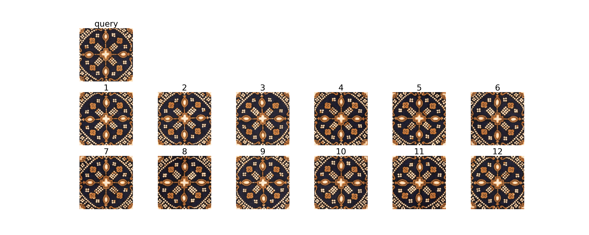
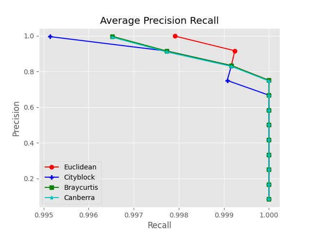
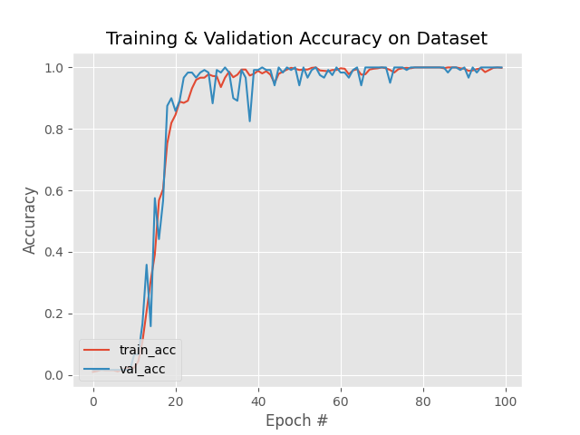
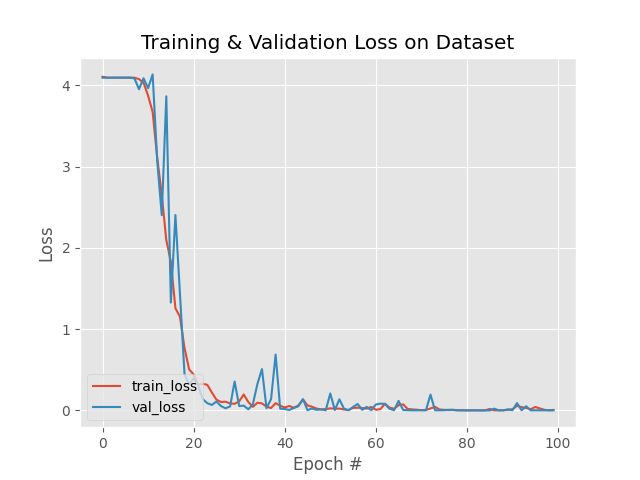

# Convolutional Neural Network (CNN) Models for Batik Image Retrieval



## Abstract
This project focuses on leveraging Convolutional Neural Networks (CNN) to enhance the retrieval of batik images, an integral part of cultural heritage preservation. It employs a tailored CNN model to accurately extract visual features and perform image matching using the Batik Nitik 960 dataset, consisting of 960 distinct Nitik batik patterns. The model demonstrates high accuracy in identifying and retrieving visually similar batik patterns, highlighting the potential of CNNs in understanding and accessing cultural heritage.

## Performance Plots

### Average Precision-Recall (APR)

This plot shows the performance of our model in terms of precision and recall across different thresholds, important for evaluating the retrieval capabilities.

### Accuracy Over Epochs

This plot demonstrates the model's accuracy progress during training phases, providing insights into the learning effectiveness.

### Training Loss

The loss plot visualizes the reduction in training loss over time, indicating the model’s increasing accuracy in encoding and retrieving batik images.


## Project Description
The "CNN Models for Batik Image Retrieval" project develops a CNN tailored for the complexities of batik patterns. By accurately processing and matching images from the Batik Nitik 960 dataset, the model serves as a crucial tool in the digital preservation and exploration of batik designs.

## Features
- **Tailored CNN Architecture**: Specifically designed for handling the intricate patterns of batik.
- **High Accuracy Retrieval**: Advanced image processing techniques to ensure precise matching.
- **Visual Similarity Assessment**: Compares query images with a database to fetch similar motifs.

## Technologies Used
- Python 3.8+
- TensorFlow 2.12
- Keras 2.12
- NumPy
- Matplotlib (for visualization)

## Usage
Follow these steps to set up and run the application:

1. **Python Version**: Ensure you have at least Python 3.7 installed on your system.
2. **Dataset**: Download and place the dataset in the same project folder to ensure the application can access it.
3. **Install Dependencies**:
   - Run the following command to install the necessary Python packages:
     ```bash
     pip install -r requirements.txt
     ```

## Contributing
Agus Eko Minarno
